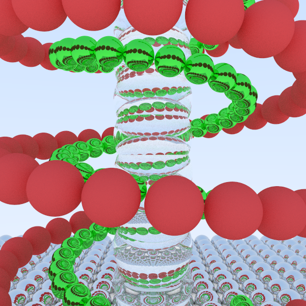

# Raytracing in One Weekend - Espirais Metálicas

Nossa versão do projeto de ray tracing, com uma cena de espirais metálicas entrelaçadas e um pilar central de vidro.

## Grupo
- Pedro Andrade Dorighello
- Cauã Marques da Silva
- Vicente Pinto Tomás Junior
- Carlos Felipe Alvarenga Falcão

## Cena Gerada

Em nosso fork, transformamos a cena original em uma composição dinâmica com:

- Duas espirais de esferas entrelaçadas (**vermelha** e **verde**)
- Um pilar central de **esferas de vidro sobrepostas**
- **Chão reflexivo** de esferas metálicas

  

## Especificações do Projeto

### Requisitos Cumpridos

- Seguimos o tutorial *Raytracing in One Weekend*
- Cena bonita com múltiplos materiais:
  - **Espiral vermelha**: lambertian
  - **Espiral verde**: metal espelhado perfeito
  - **Pilar central**: esferas de vidro com refração
  - **Chão reflexivo**: metal brilhante
- Posição da câmera ajustada:
  - Ângulo mais próximo 
  - Vista levemente superior para melhor apreciação das espirais


## Construção e Execução

O projeto usa **CMake**. Para construir:

```bash
# Configuração
$ cmake -B build

# Compilação (todas as targets)
$ cmake --build build

# Compilar específico (nosso caso)
$ cmake --build build --target inOneWeekend

# Gerar imagem
$ build/inOneWeekend > image.ppm

# Converter imagem
$ convert image.ppm image.png
